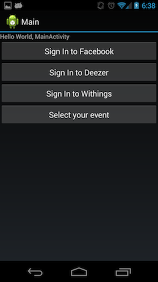
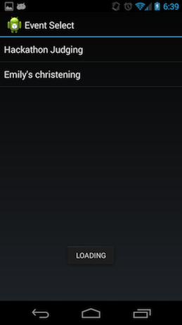

PRTE! 
===========================

Will aggregate your Facebook Events, Deezer Playlist and Withings Friends Activity to give you statistics for fun or to improve your partys!

Potential to:

Show stats of the songs most danced to
Invite guests based on how energetic or lazy they are
Create automatice playlists dependant on what people are like to dance
Tailor your guest list to the music or the music to your guest list

____

Hackathon check list
======

Login with Facebook 
Login with Deezer 
Login with Withings 

Select Facebook Event                                 - DONE 
	- match with Deezer songs from that timeframe      - DONE 

Find Facebook users who attended event                 - DONE 
Cross match this with friends who have Withings        - DONE 
Find these users withings events and movements         - DONE 
Correlate with songs i.e. who danced to what           - DONE 
Create stats board                                     - DONE 
    - person danced most 
    - song most danced to 
    - least active 
Share on Facebook 
